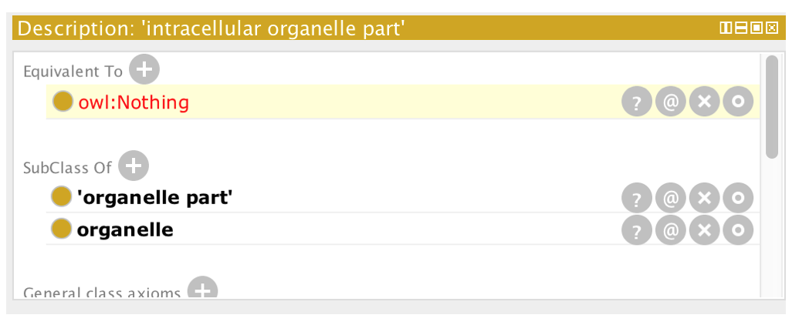

# Disjointness

In the chromosome-parts-interim.owl file (that you have now saved locally on your computer), at the top of our class hierarchy we have cell, cell part, chromosomal part, intracellular part, organelle and organelle part. By default, OWL assumes that these classes can overlap, i.e. there are individuals who can be instances of more than one of these classes. We want to create a restriction on our ontology that states these classes are different and that no individual can be a member of more than one of these classes. We can say this in OWL by creating a _disjoint classes_ axiom.

_If you do not already have it open, load your previous ontology that was derived from the "interim file. Note: you can open a recent file by going to File-> Open Recent_

We want to assert that **organelle** and **organelle part** are disjoint. To do this first select the **organelle** class. In the class 'Description' view, scroll down and select the (+) button next to Disjoint With. You are presented with the now familiar window allowing you to select, or type, to choose a class. In the hierarchy panel, you can use CTRL to select multiple classes. Select 'organelle part' as disjoint with organelle.

Note that the directionality is irrelevant.  Prove this to yourself by deleting the disjoint axiom, and adding it back from **organelle part**.

## Reasoning and inconsistency checking

We have introduced a deliberate mistake into the ontology. We previously asserted that **intracellular organelle part** is a subclass of both **organelle part** and **organelle**. We have now added an axiom stating that **organelle** and **organelle part** are disjoint.  We can use the reasoner to check the consistency of our ontology. The reasoner should detect our contradiction.

Protégé comes with several reasoners, and more can be installed via the plugins mechanism (see plugins chapter). Select a reasoner from the Reasoner menu (Elk, HermiT, Pellet, or Fact++ will work). Once a reasoner is highlighted, select &quot;Start reasoner&quot; from the menu. _Note: you may get several pop-boxes/warnings, ignore those._

The **intracellular organelle part** class will have changed to red indicating that the class is now _unsatisfiable_.

You can also see unsatisfiable classes by switching to the inferred view.

Here you will a special class called **Nothing**. When we previously said that all OWL classes are subclasses of OWL Thing. OWL **Nothing** is a leaf class or bottom class of your ontology. Any classes that are deemed unsatisfiable by the reasoner are shown as subclasses or equivalent to OWL Nothing. The inferred view will show you all subclasses of Nothing.

Once the ontology is classified inferred statements or axioms are shown in the various panels with a light-yellow shading. The class description for **intracellular organelle part** should look something like the screen shot below. You will see that the class has been asserted equivalent to the **Nothing** class. Inside this statement, a small question mark icon appears, clicking this will get an explanation from the reasoner for this inconsistency.

Select the (?) icon to get an explanation for this inconsistency. The explanation shows the axioms involved. We see the disjoint class axiom alongside the two subclass axioms are causing the inconsistency. We can simply repair this ontology by removing the **intracellular organelle part** subClassOf **organelle** axiom.

Remove the Disjoint with axiom (click the (x) beside **organelle** in the Description pane for **intracellular organelle part**), and resynchronise the reasoner from the reasoner menu. Save your ontology, you'll return to it after this following exercise.
