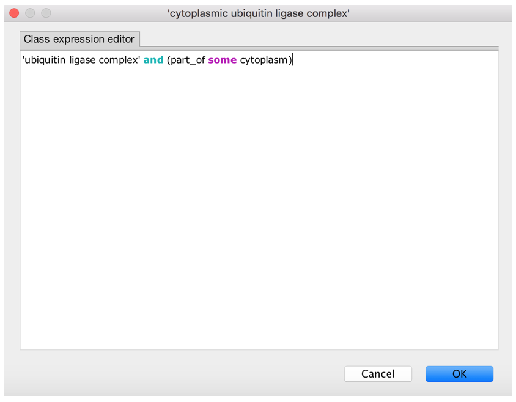
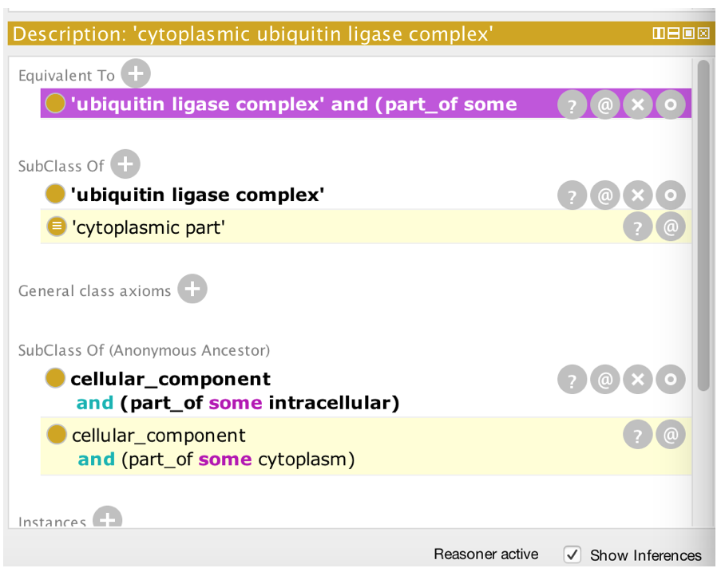
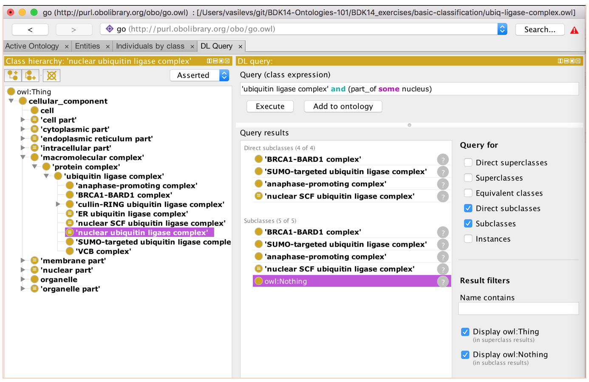

# Automatic classification

# EXERCISE: Basic classification

The file you need is in the basic-classification folder. Follow the instructions below.

This example introduces 'defined classes' and automatic classification. The example involves classification of different ubiquitin ligase complexes. It is based on a subset of the gene ontology (GO) [http://purl.obolibrary.org/obo/go.owl](http://purl.obolibrary.org/obo/go.owl) with some classes removed for teaching purposes.

Constructs:

- and (intersection)
- equivalence (logical definitions)
- existential restrictions (e.g. part\_of some)

Background knowledge for non-GO people:

GO includes pre-composed grouping classes such as 'chromosomal part' and 'nuclear part'.

**PART 1: Adding classes and automatically classifying them**

1. Open basic-classification/ubiq-ligase-complex.owl
2. Navigate to 'ubiquitin ligase complex'
3. Add a subclass of 'ubiquitin ligase complex' called 'cytoplasmic ubiquitin ligase complex'
  1. NOTE: do this \*directly\* under the 'ubiquitin ligase complex' class, don't move things around!
  2. NOTE: this class already exists in the main GO, but it has been removed for this tutorial example
4. Give it a logical definition (equivalence axiom)

1. Synchronize the reasoner
2. Find the class you made under 'Class hierarchy (inferred)'
3. You should see 'cytoplasmic part' is now inferred to be a parent class of 'cytoplasmic ubiquitin ligase complex'.

**PART 2: Another example**

1. Do the same for 'nuclear ubiquitin ligase complex' – create the class and add the equivalence axiom.
2. Synchronize the reasoner.
3. You should see 'nuclear ubiquitin ligase complex' is inferred to be a child of 'nuclear part'.

**BONUS:**

1. Remove the classes you have created.
2. Find all 'ubiquitin ligase complex' classes whose instances are in a nucleus in the DL query tab
3. Make the class directly from here

