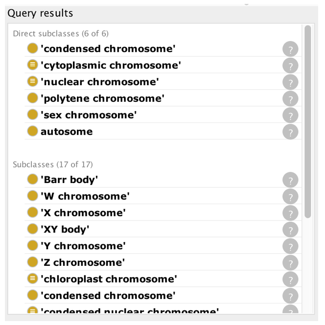
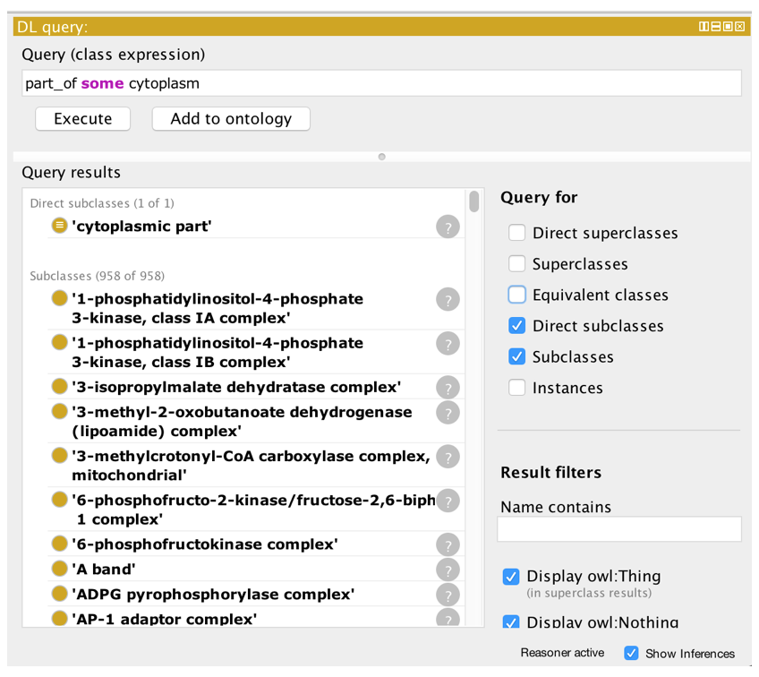
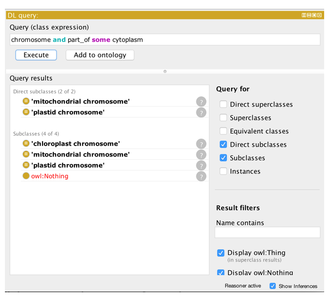
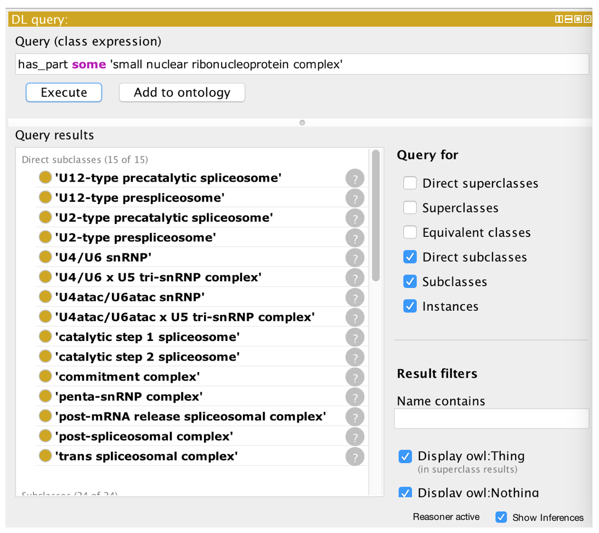
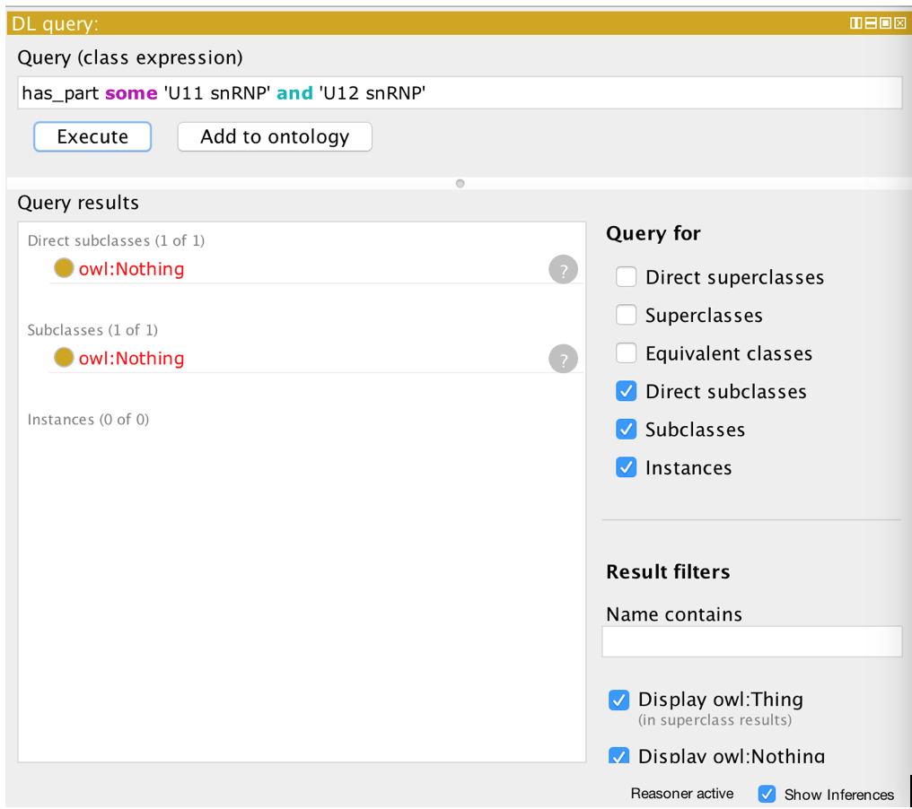
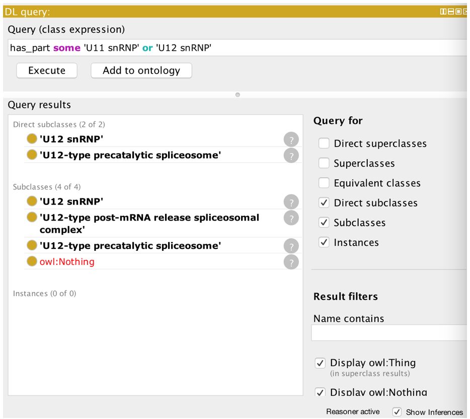
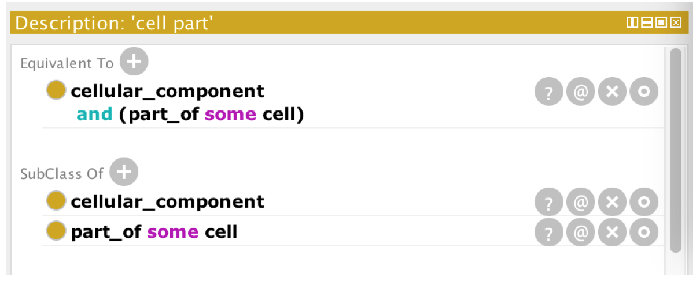

# EXERCISE: Basic DL Queries

Go to the 'basic-dl-query' folder in the Exercises directory and open the file cc.owl.

This illustrates basic DL (description logic) queries.

A DL query is a class expression that is constructed using constructs such as 'and' (corresponding to set intersection) and 'some' (see previous example).

Note that the example that follows this one also revisits DL queries.

Constructs used: 'and', 'some'

1. open cc.owl
2. Turn on the ELK reasoner
3. Go to DL query tab
4. Find all subtypes of chromosome

1. Experiment with the tab - what do the different checkboxes give you?
2. Find all parts of a cytoplasm

1. Find all chromosomes that are part of a cytoplasm

NEXT:

1. Find all classes whose instances have a snRNP ('small nuclear ribonucleoprotein complex') as part

1. Find all classes whose instances have both a U11 snRNP AND a U12 snRNP as parts

1. Find all classes whose instances have both a U11 snRNP OR U12 snRNP as parts

1. Create a class from this DL query by clicking the 'Add to ontology' button.

## Equivalent classes

The previous example showed the creation of a class restriction. These restrictions were asserted as superclass restrictions, and are sometimes known as _necessary conditions_. That is, if an individual is a member of the 'cell part' then it is necessary for it to also be related to a 'cell' along the 'part of' property.

Necessary conditions alone mean that individuals can exist that are part of a cell, but are not a type of 'cell part'. In OWL, we can make an even stronger statement and define the 'cell part' class as being equivalent to 'part of' some cell. This is known as a necessary and sufficient condition.

In Protégé we can create an equivalent class restriction inside the 'Equivalent To' slot of the class description view.

