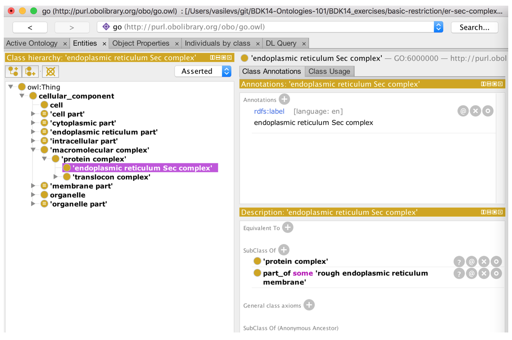
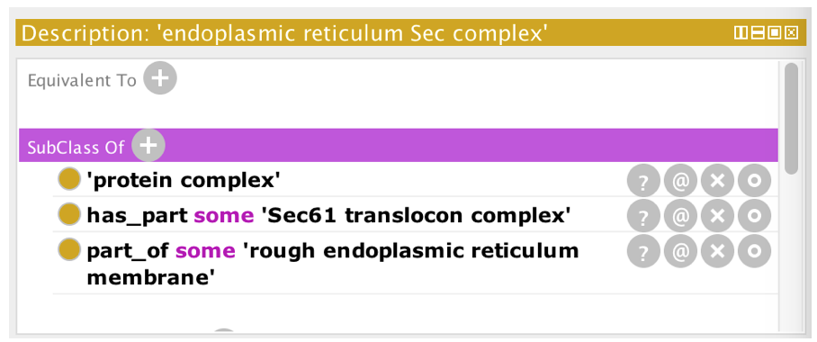

# EXERCISE: Basic Restictions

This example illustrates how to use object properties to make existential restrictions.

In OWL, it helps to think in terms of the set of entities represented by each class. To say: 'every finger is part of a hand' we say:

finger SubClassOf part\_of some hand

The anonymous class expression 'part\_of some hand'; represents the set of all instances that have a part\_of relationship to a hand. Every member of the set of all fingers is a member of the set of all things that are part of a hand.

Instructions:

1. Open er-sec-complex.owl from the basic-restiction folder
2. Navigate to the class &quot;protein complex&quot; using the search box
3. Add a class 'endoplasmic reticulum Sec complex' as a subclass of &quot;protein complex&quot;
4. Say that every 'endoplasmic reticulum Sec complex' is part of a 'rough endoplasmic reticulum membrane'

1. Say that a 'endoplasmic reticulum Sec complex' has a 'Sec61 translocon complex' as part

Navigating over the resulting ontology:

1. Synchronize the reasoner
2. Navigate to 'rough endoplasmic reticulum membrane'.
3. Find the parts of the rough ER membrane. To do this, go to the DL query tab and write the query as depicted below. Your results should look something like the screenshot below.

 

_Aside_

If you like, you can look up the current GO file (open go.owl from http://purl.obolibrary.org/obo/go.owl directly in Protégé -> File-> 'open from URL' to examine how the part of restrictions in the actual ontology were created.
