# EXERCISE: Basic Subclass Hierarchy

Go to the directory basic-subclass in the BD2K14\_exercises folder and open /basic-subclass/chromosome-parts.owl.

This example illustrates adding classes and class annotations into an existing Subclass hierarchy.

_Note: This example does not make use of reasoning / automated classification or class expressions._

Constructs illustrated:

 - Adding subclasses
 - Adding annotations to classes
 - Adding DatabaseCrossReferences (xref) classes

**Instructions:**

_Add Subclass_
1. Open chromosome-parts.owl and navigate to the Entities tab.
2. Add the class "replication fork" to the ontology as a subclass of 'chromosomal part'. (Don't worry about the ID.) _Note: Most ontologies use lowercase labels, except for proper names._
    
    a. To find the class 'chromosomal part', you can navigate through the hierarchy, or use the search function, see screenshot below. Make sure you select "Show all results". In the search results, double click on the highlighted class and it will open it up in the Class hierarchy pane.

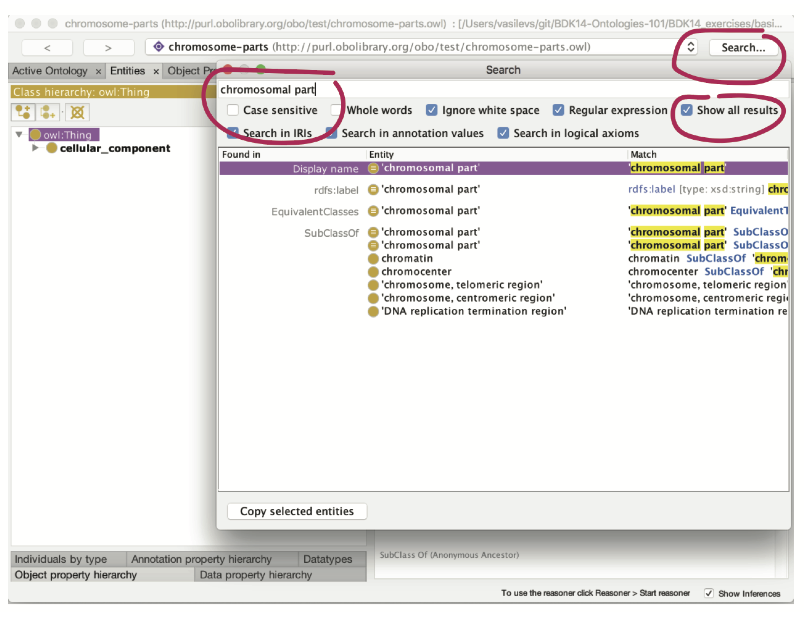

_Moving around classes:_

3. Add the term "intracellular non-membrane-bounded organelle" as a subclass of "Thing"
4. Move it, by dragging and dropping, to place it as a subclass of 'non-membrane-bounded organelle' (if you do not see the class 'non-membrane-bounded organelle';, search for it by clicking the 'search' radio button in the upper right.)

Your hierarchy should look something like this:

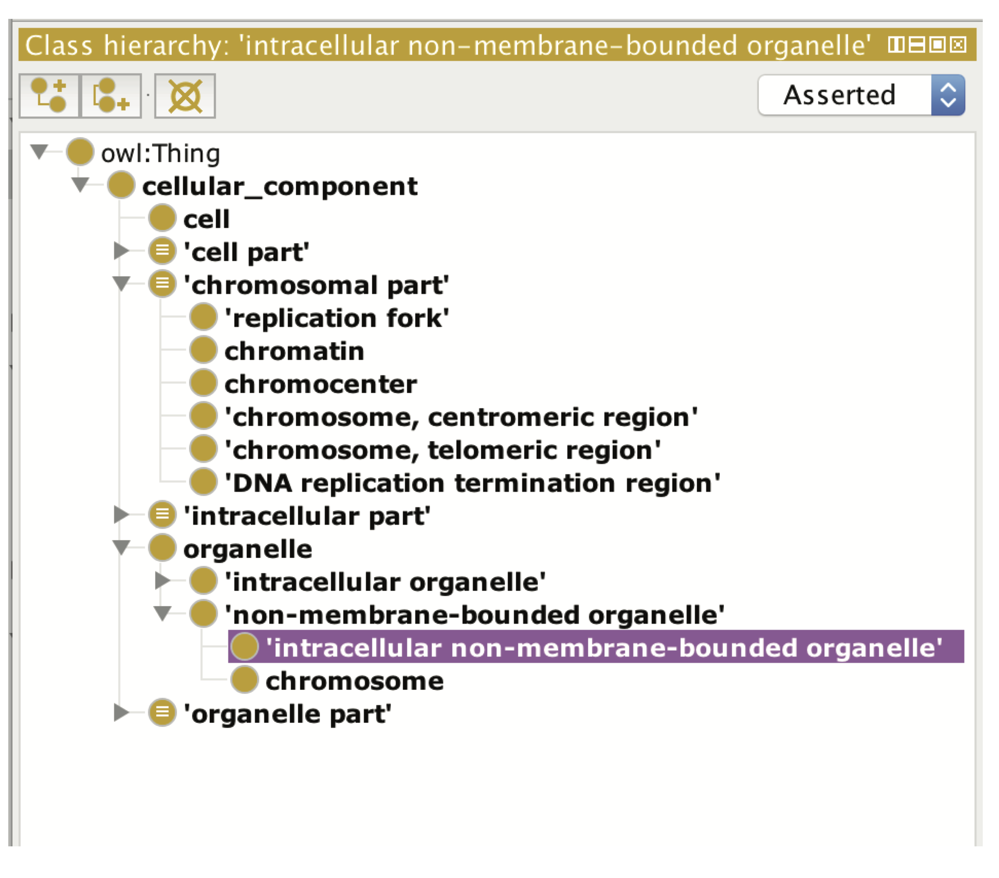

_Annotations_

The goal is to recreate the existing information from GO on the "replication fork" class.

5. Click on the 'replication fork' class you just created.
6. In the Annotations pane on the right, use the (+) next to 'Annotations' to add an annotation.

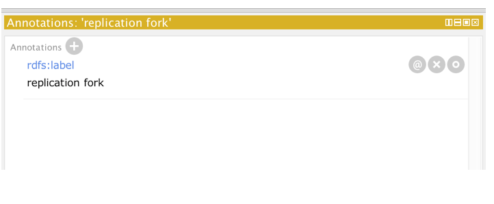

You will add the annotation values listed are below, detailed instructions follow. Make sure you click on the correct annotation on the left for each annotation.

**id:** GO\_0005657

**rdfs: label:** replication fork

**definition:** The Y-shaped region of a replicating DNA molecule, resulting from the separation of the DNA strands and in which the synthesis of new strands takes place. Also includes associated protein complexes.

**database\_cross\_reference:** ISBN:0198547684

**has\_related\_synonym:** replication focus

**xref:** Wikipedia:Replication\_fork

_Detailed instructions:_

Add the following (using the values above)

1. **A text definition for the class**
- Click on the "replication fork" class, then click (+) by Annotations
- By default, the window should be on the "Literal" tab
- Click (select) "definition" on the left

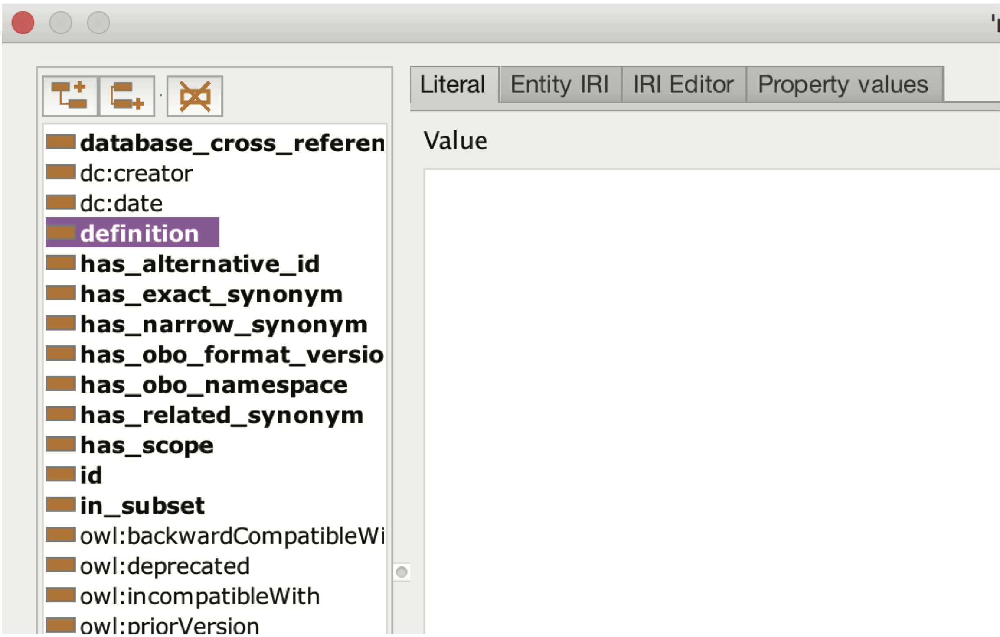

- Enter the definition in the window: The Y-shaped region of a replicating DNA molecule, resulting from the separation of the DNA strands and in which the synthesis of new strands takes place. Also includes associated protein complexes. _Note: Make sure there are not any extra spaces at the end of the sentence._
- Click OK. The annotation should appear in the Annotations window.

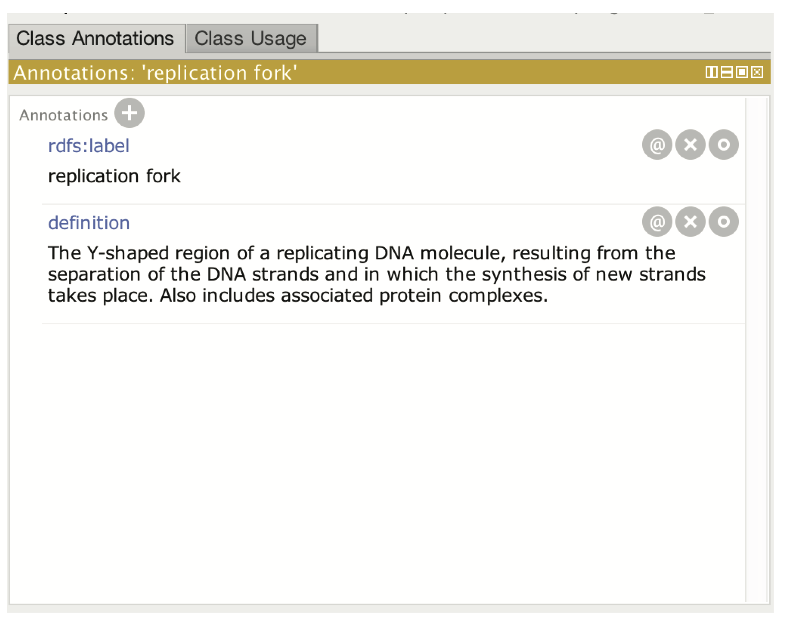

**2. dbxrefs to the text definition**

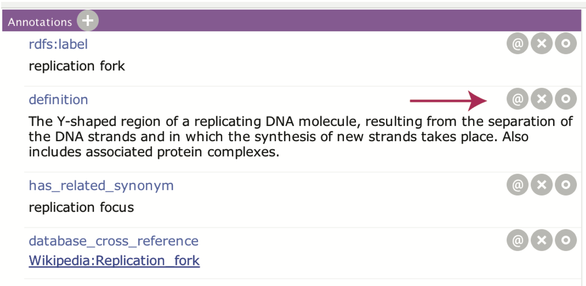

- Click the (@) icon beside the definition annotation
- A new box will open, and click the (+) beside Annotations
- Select "database\_cross\_reference" in the left pane
- Enter a value. This is often a PubMed ID (in the format PMID:xxxxxx) or your ORCID ID or initials. For this exercise, enter the initials: mah.
- Repeat for the other cross reference: ISBN:0198547684
- Your annotations should look like the screenshot below.

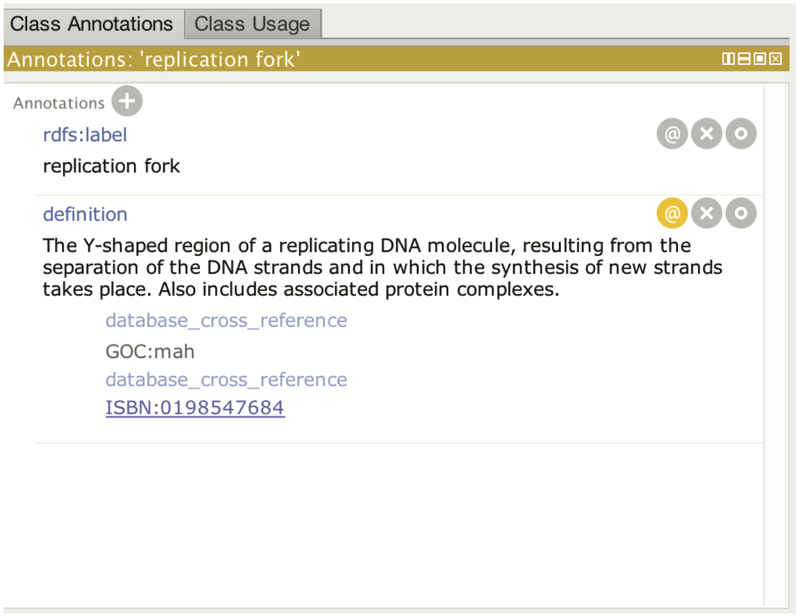

**A related synonym**

- Add an annotation to "replication fork" with the (+)
- Choose "has\_related\_synonym" and enter the value: replication focus
- Add an xref to the class itself:
- click the (+) beside annotations
- Choose database\_cross\_reference
- Add xref (Wikipedia:Replication\_fork)
- Click OK

Your annotation pane should look something like this:

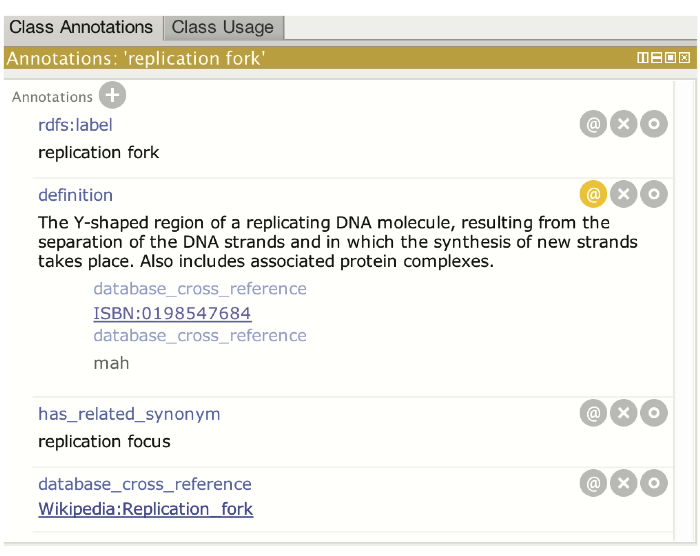

**Synonym properties:**

7. Add the subclass "site of double-strand break" to the ontology under "chromosomal part"
8. Add a synonym with a dbxref annotation. E.g. synonym: "site of DSB" has\_exact\_synonym [PMID:21035408]

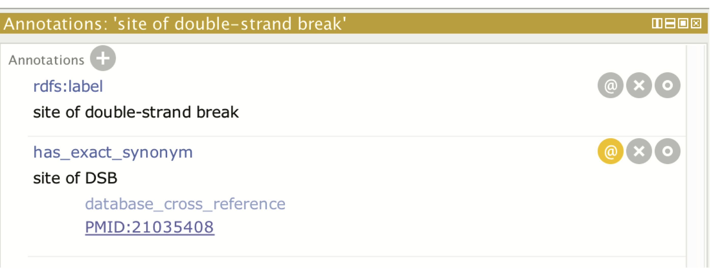

Note that there are different synonym annotations:
- has\_exact\_synonym: a synonym that has the exact same meaning as the class name
- has\_narrow\_synonym: a more specific synonym
- has\_related\_synonym: a related term

## The Class description view

Open the ontology chromosome-parts-interim.owl, found in the "basic-subclass" exercise folder.  Save it to your local computer using Save-as.

We have seen how to add sub/superclasses and annotate the class hierarchy. Another way to do the same thing is via the Class description view (circled in the figure below). When an OWL class is selected in the entities view, the right-hand side of the tab shows the class description panel. If we select the **cell** class, we see in the class description view that this class is a "SubClass Of" (= has a _SuperClass_) the **cellular\_component** class. Using the (+) button beside "SubClass Of" we could add another superclass to the cell class.

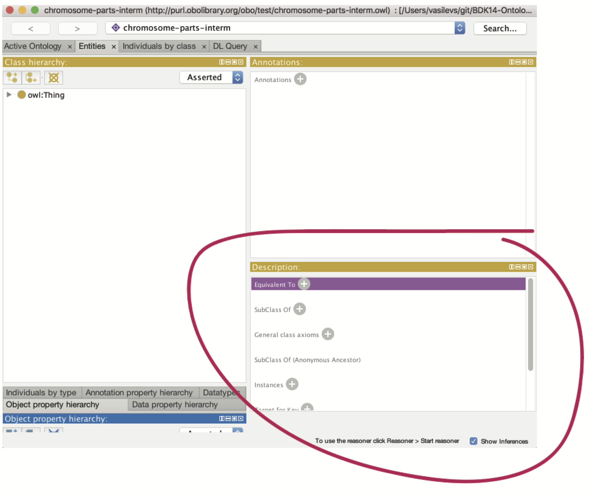

Select the **intracellular organelle part** class in your ontology. Notice it is a SubClass of **organelle part.** Using the SubClass Of (+) button, add the **organelle** class as a super class. There are various ways to assert a superclass. The simplest it to just type in the class expression editor. _Hint: Pressing Tab (or CTRL + SPACE on a Mac) allows you to autocomplete on a term._

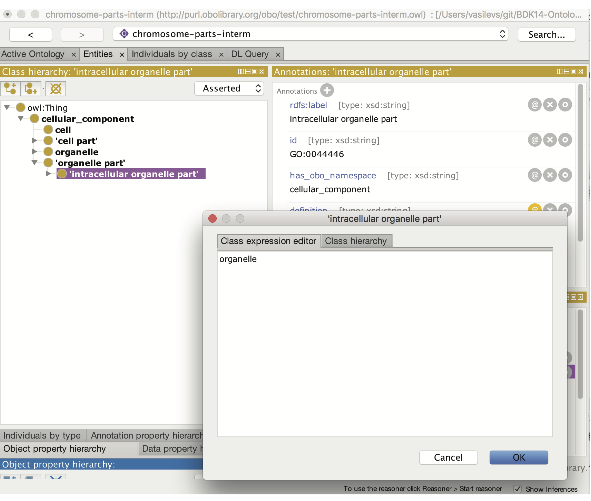

You can also use the class hierarchy tab here to search, browse and select the appropriate class.

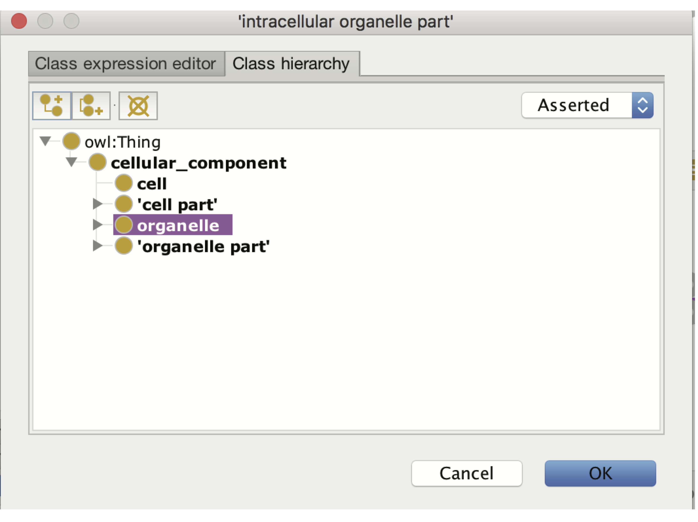

The **intracellular organelle part** class will now have two parents asserted in the class hierarchy. You will also be able to see both parents in the class description view.

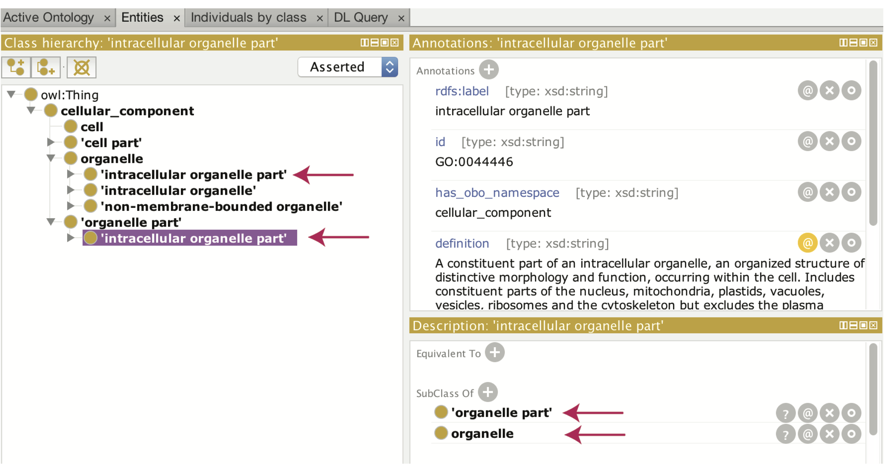

Save your interim ontology to your computer. _Note: You will use this same file in the next section: Disjointness._
