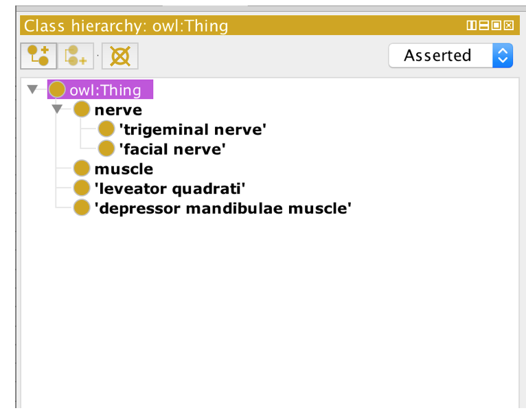
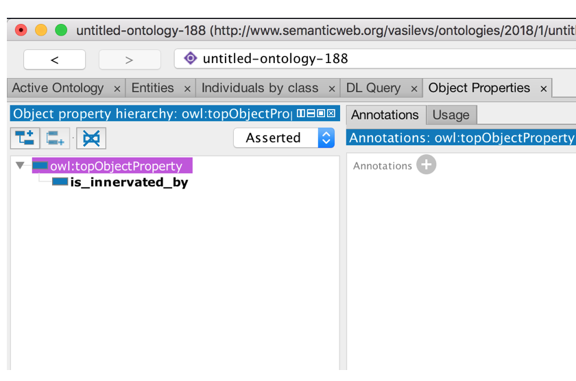
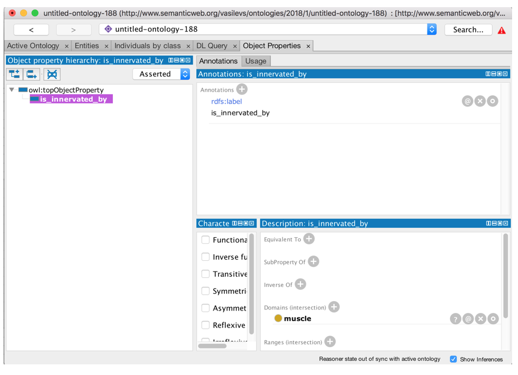
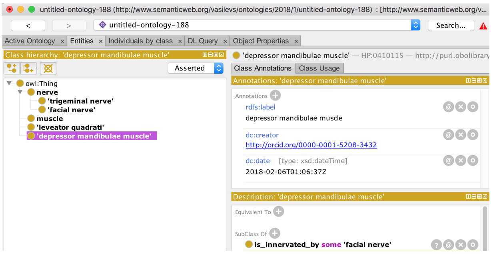
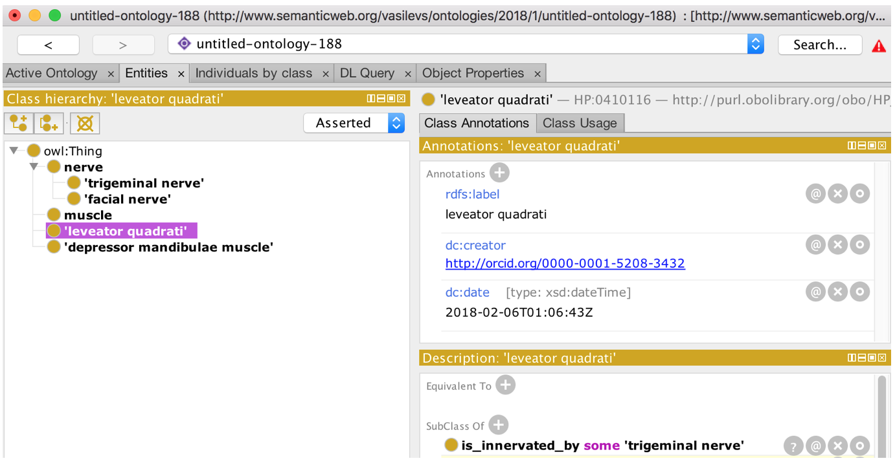
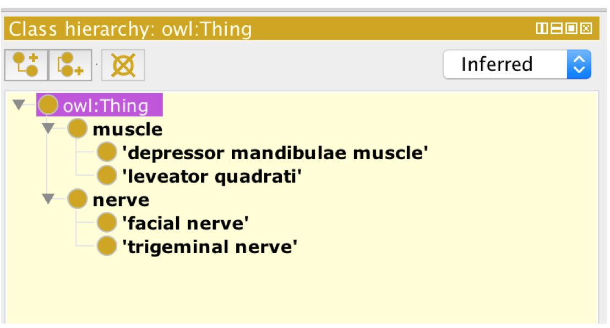

# Object Properties

# EXERCISE: Domains and Ranges

Got to the domain-range folder and follow the instructions below. This introduces the concepts of 'domains' and 'ranges' on object properties.

In this exercise, we will illustrate how object properties can be used to subclassify classes that are restricted by them.

1. Create a new ontology.
2. Add the following class hierarchy:

depressor mandibulae muscle
leveator quadrati
muscle
nerve
facial nerve
trigeminal nerve

1. Add the following:

- An object property named 'is\_innervated\_by'

- Add a domain on 'is\_innervated\_by' - 'muscle'

- To 'depressor mandibulae muscle' a subclass restriction 'is innervated\_by some 'facial nerve''

- To 'leveator quadrati' a subclass restriction 'is innervated\_by some 'trigeminal nerve'

1. Now run the reasoner and inspect the inferred class hierarchy. You should see a new classification under the 'muscle' class.

