### The entities tab

You will see along the top of the screen various tabs. Each tab provides a different perspective on the ontology. An entity is any class, property (object, data, or annotation), or individual. For example, the classes tab allows us to view and edit the classes in the ontology, and similarly the object properties tab focuses on the object properties in the ontology. The _primary tab_ where you will spend most of your time is the Entities tab.

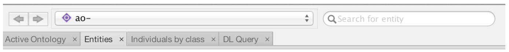

Select the Entities tab and then select the Thing class. Thing is the root class for all OWL ontologies and it cannot be deleted in Protégé.  

The Entities tab is split into two halves. The left-hand side provides a suite of panels for selecting various entities in your ontology. When a particular entity is selected the panels on the right-hand side display information about that entity. The entities panel is context specific, so if you have a class selected (like Thing) then the panels on the right are aimed at editing classes. The panels on the right are customizable. Based on prior use you may see new panes or alternate arrangements. 

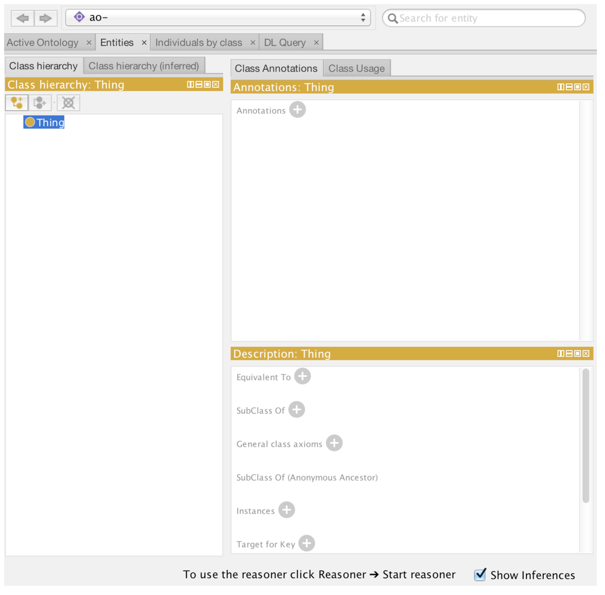

#### Creating your first class

By far the most common panel for working with your ontology is the **Class hierarchy panel.**

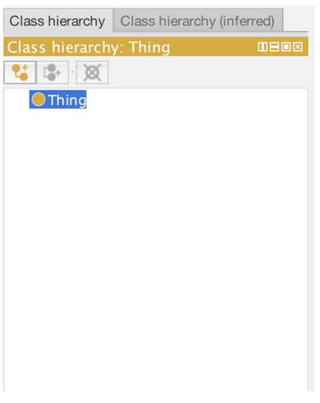

There are three button at the top of the class hierarchy view. These allow you to add a **subclass (L-shaped icon)**, **add a sibling class (c-shaped icon)**, or **delete a selected class (x’d circle)**. Click the add subclass button to add a child class to OWL thing. 

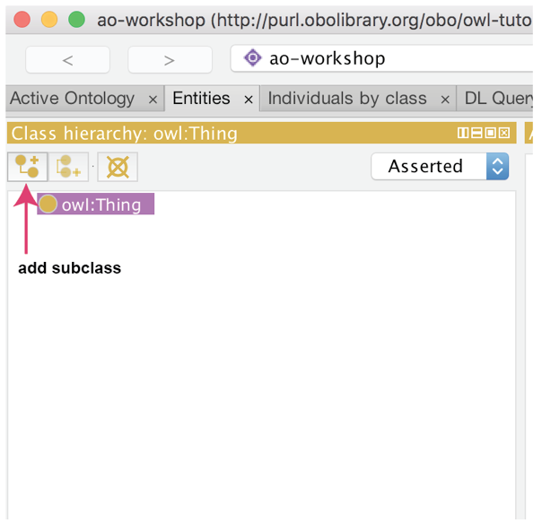

A dialog will popup. For now, simply name this class **cellular_component**.  Click “OK” to add the class.

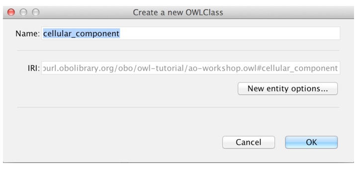

The class should have been created as follows. By default, Protégé will use the ontology IRI, followed by a #, followed by your specified name (replacing spaces with underscores) as the unique IRI for this entity. If you hover over this class with your mouse you will see the full IRI for this class.  Important: If you have previously configured an IRI generation scheme you may see your IRI being generated in an alternate format (see below).

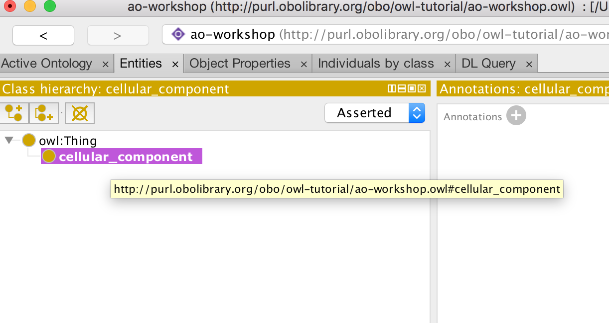

#### Renaming an entity

We can change the IRI for a concept using the rename function in the Refactoring menu. Note that this function can also be accessed with a command U keystroke. Rename the **cellular_component** class to use its proper IRI from the Gene Ontology [http://purl.obolibrary.org/obo/GO_0005575](http://purl.obolibrary.org/obo/GO_0005575)

Make sure to check the “Show full IRI” box so you can edit the full IRI.

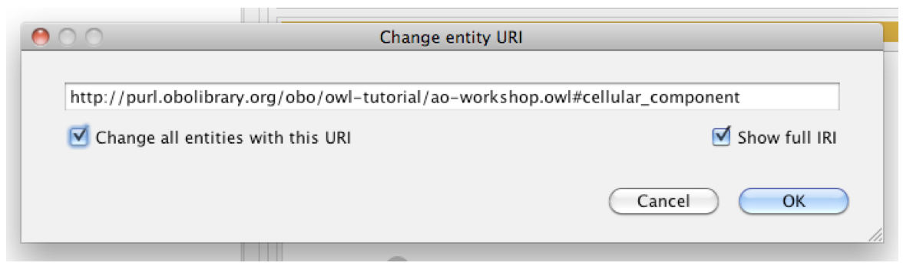

And then paste or type in the correct GO URI (http://purl.obolibrary.org/obo/GO_0005575). 

Now the correct GO URI appears in the ontology; in the Class hierarchy panel, the class will appear as “GO_0005575” (to those who have used Protégé before you might see a different label). Luckily you don’t have to rename every entity you create when building your own ontology; Protégé provides a “New Entities” preferences panel where you can specify how new IRI should be created, described in the next section. 

#### New entities

Terms in the ontologies we use have separate names and IDs. The names are annotation values (labels) and the IDs are represented using IRIs. The OBO foundry has a policy on IRI (or ID) generation (http://www.obofoundry.org/principles/fp-003-uris.html). You can set an ID strategy using the “New Entities” tab under the Protégé preferences – on the top tool bar, click the “Protégé dropdown, then click Preferences.

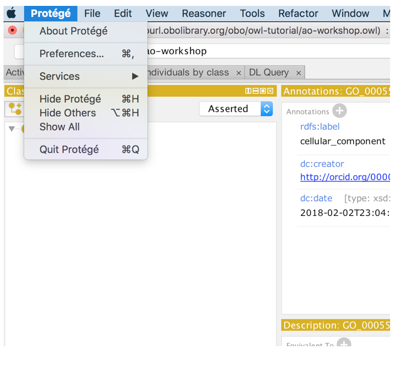

Set your new entity preferences as in the following screenshot, then choose the New Entities tab):

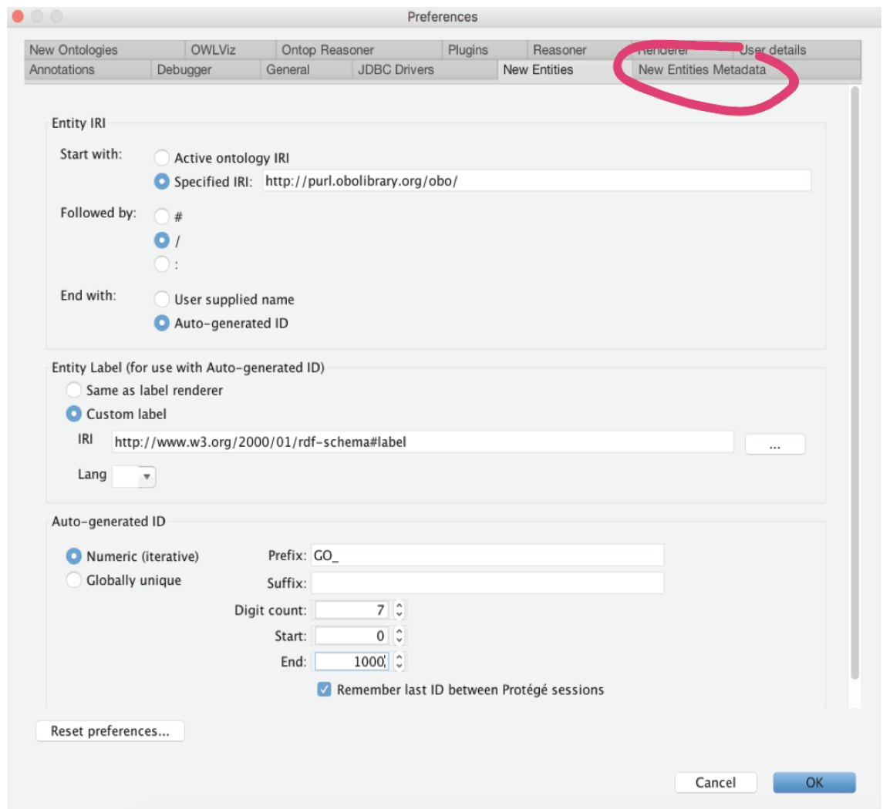

For ontologies other than GO, change the value of the prefix. 

Note that all OBO library ontologies should use the “Specified URI” value: http://purl.obolibrary.org/obo

#### Adding annotations properties

Using Protégé you can add annotations such as labels, descriptions, cross references (xrefs) to any OWL entity. The panel on the right, named Annotations, is where these annotations are added. Use this panel to add a **cellular_component** label to the class you created previously (notice how when changed the IRI, you also lost your label. This is because the label was previously part of the IRI, and Protégé was rendering the label based on the IRI. We’ll fix that in a minute.)  Click on the GO labelled class to select it.

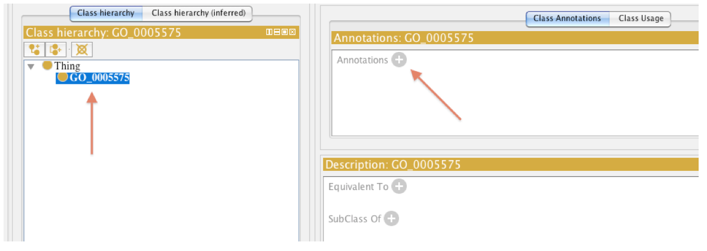

Select the + button to add an annotation to the selected entity. Protégé has a set of built in annotation properties, such as label and comment – add rdfs:label “cellular_component” and click OK. You can also add a comment such as “created during BDK14 tutorial”, by clicking the + sign again, choosing “rdfs:comment” on the left hand side bar, and typing your comment in the “Literal” box, then click OK. 

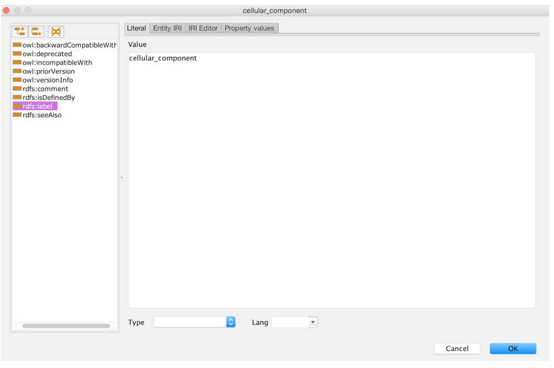

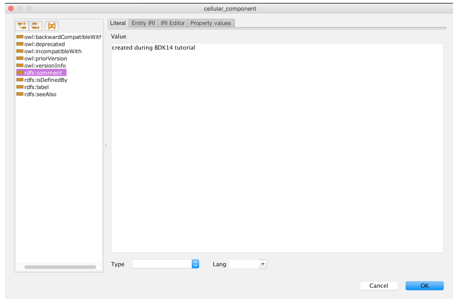

Note that often you will start from an existing OWL file, then your ontology will include a pre-declared set of annotation properties such as ‘has exact synonym’ and ‘definition’. _You may never need to create your own annotation properties._

#### Setting label rendering

You can change how Protégé renders entities. It is common to want to view entities by their **label**, rather than **identifiers.** In fact, you can tell Protégé to render on any annotation property you choose. Experiment with the different options in the menu, and to conclude, set the rendering to use the class label (rdfs:label). 

In the View menu choose “Render by label”:

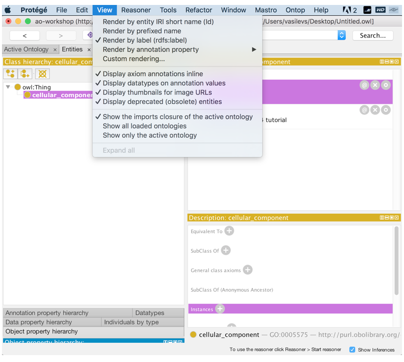

The **cellular_component** class will now render in the hierarchy view using the value of the label annotation property. Note that the ability to flip between different renderings can often be very useful in old versions of Protégé, as the Protégé search box in the upper right searches on whatever is rendered.  If you are using an older version of Protégé, searching for a term by ID for example, it can be useful to render by ID and then flip back to render by label. In the 5.1 version, the search box will search for either labels or ID.

#### Creating the class hierarchy

We will now create a simple class hierarchy. In Protégé, ‘class hierarchy’ typically refers to a sub/superclass hierarchy (also known as an _‘is_a’_ hierarchy in OBO format). We will return to relations such as _‘part_of’_ later on in this tutorial. For now, we will take advantage of the fact that the GO cell component ontology allows us to bypass this for now by means of classes such as ‘cell part’ and ‘nuclear part’.

Classes may be quickly added to an ontology with the **add subclass (vertical arrow below)** and **add sibling class (horizontal arrow below)** icons in the class hierarchy view.

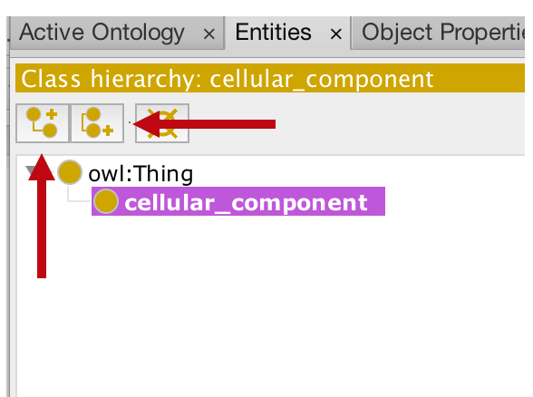

Use the **add subclass (vertical arrow below)** and add **sibling class (horizontal arrow below)** buttons to create a hierarchy that looks like the following (your window will look slightly different than the view below which is from an earlier version of Protégé).  Note that you can click and drag classes in the hierarchy to re-arrange them. When planning your own ontology take a good amount of time to standardize your label format, check other ontologies, and be consistent.

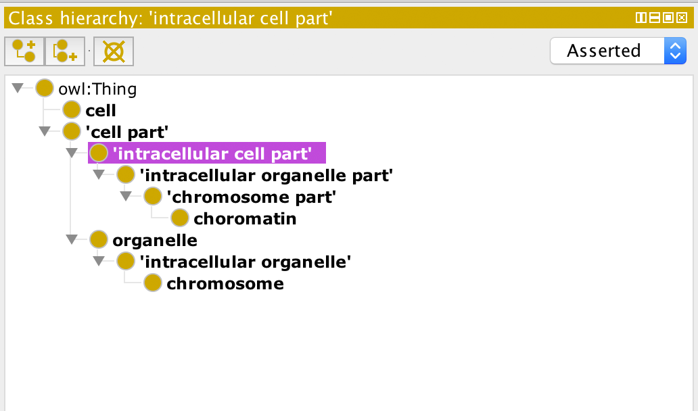

Don’t bother to add textual definitions, synonyms, etc. at this stage, as you won’t be using this ontology in latter exercises. _Note: the order of the classes in your Class hierarchy may not be the same as you see in the screenshot (e.g. 'cell part' may appear above cell). Don’t worry about this. Just make sure that the subclass relationships are correct._
