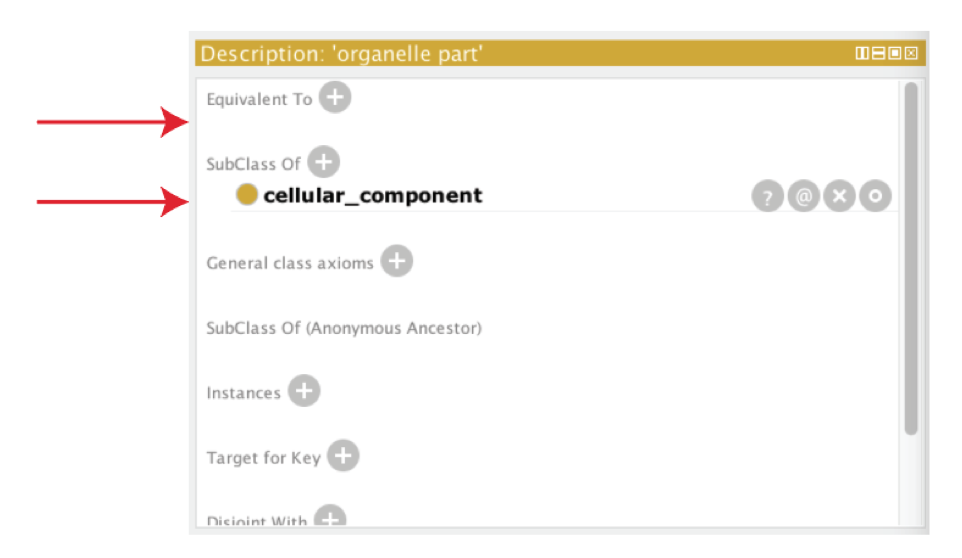
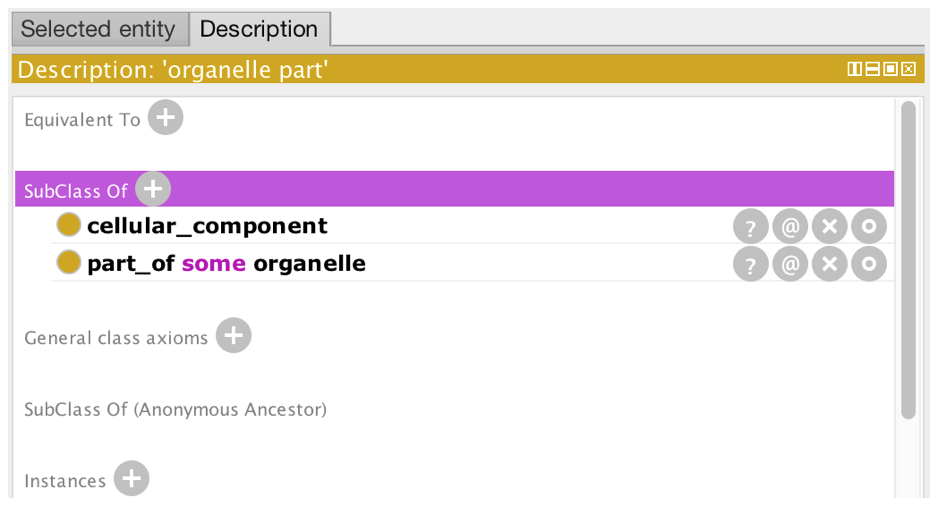

# OWL class restrictions

_Keep the previously opened interim ontology open_.

As previously stated, in OWL we use object property to describe binary relationships between two individuals (or instances). We can also use the properties to describe new classes (or sets of individuals) using _restrictions_. A restriction describes a class of individuals based on the relationships that members of the class participate in. In other words, a restriction is a kind of class, in the same way that a named class is a kind of class.

For example, we can use a named class to capture all the individuals that are chromosome parts. But we could also describe the class of chromosome parts as all the instances that are '_part of'_ a chromosome.

In OWL, there are three main types of restrictions that can be placed on classes. These are **quantifier restriction** , **cardinality restrictions** and **hasValue** restriction. In this tutorial will initially focus on quantifier restrictions.

Quantifier restrictions are further categorized into two types, the **existential** and the **universal** restriction.

- **Existential** restrictions describe classes of individuals that participate in at least one relationship along a specified property to individuals that are members of a specified class. For example, &quot;the class of individuals that have at least one ( **some** ) 'part of' relationship to members of the 'Chromosome class&quot;. In Protégé, the keyword ' **some'** is used to denote existential restrictions.
- **Universal** restrictions describe classes of individuals that for a given property only have relationships along this property to individuals that are members of a specified class. For example, we can say a cellular component is capable of many functions using the existential quantifier, however, OWL semantics assume that there could be more. We can use the universal quantifier to add closureto the existential. That is, we can assert that a cellular component is capable of these function, and is only capable of those functions and no other. Another example is that the process of hair growth is found **only** in instances of the class Mammalia. In Protégé the keyword &quot; **only**&quot; is used.

In this tutorial, we will deal exclusively with the existential (some) quantifier.

## Superclass restrictions

_Strictly speaking in OWL, you don't make relationships between classes_, however, using OWL restrictions we essentially achieve the same thing.

We want to capture the knowledge that the named class ' **organelle part**' is part of an **organelle**. In OWL speak, we want to say that every instance of an ' **organelle part**' is also an instance of the class of things that have at least one 'part of' relationship to an ' **organelle'**. In OWL, we do this by creating an existential restriction on the ' **organelle part**' class.

In the Entities tab, select ' **organelle part**' in the class hierarchy and look at its current class description in the bottom right box. At the top of this view there are two slots for defining **equivalent classes** and superclasses (as denoted by the SubClass Of list). ' **organelle part**' already has one superclass named **cellular\_component**.

We will create a restriction on ' **organelle part**' stating ' **organelle part**' has a _'part of'_ relationship to some ' **organelle**'. Select the (+) icon next to the SubClass Of slot. Select the Class expression editor pane.  We will define this _anonymous superclass_ in Manchester OWL syntax as 'part\_of some organelle'.

The class restriction will be shown in the SubClass of slot as follows.

Using Protégé create your own part\_of restrictions for the ' **cell part**', ' **intracellular part**' and ' **chromosomal part**' classes. _Note: you must use single quotes around text strings that are separated by a space, e.g. 'intracellular organelle part'._

NOTE: After each edit to the ontology you might want to synchronize the reasoner to make sure you didn't introduce any inconsistencies into your ontology. The edit, reason, edit, reason iteration becomes particularly important as your ontologies grow more complex.
