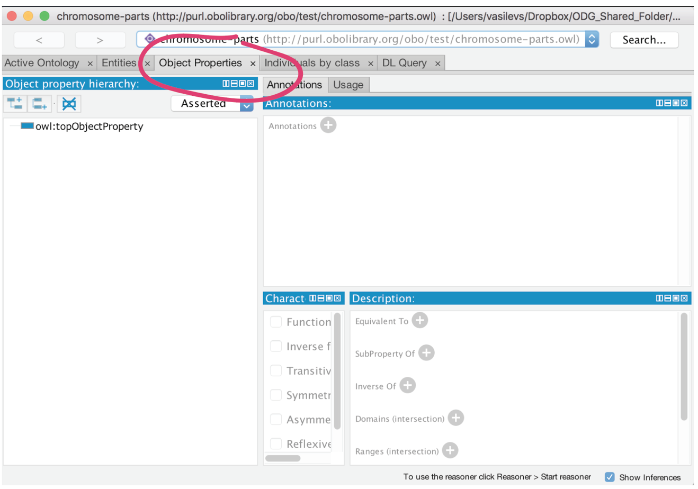
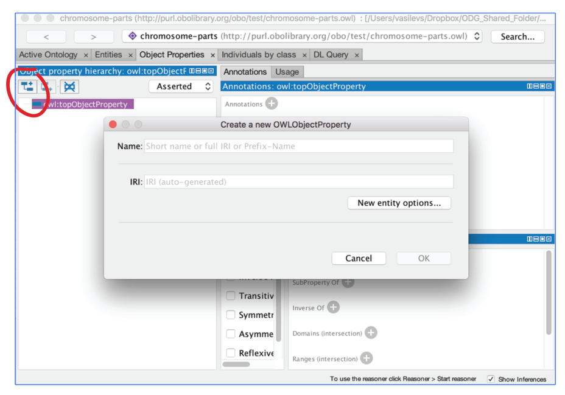
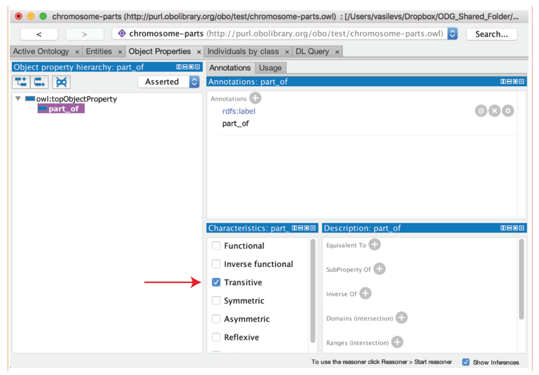

# Object properties

Re-open your previously saved ontology, which you may have named something like "chromosome-parts-interim.owl".

We will now create an object property and use this to add some restrictions onto classes. In OWL, object properties are used to assert relationships between individuals (or instances). Object properties in OWL can have characteristics such as being _transitive_ or _symmetric_. We can assert additional information about properties such their _domain_ and _range_, along with defining _inverse_ properties.

## Create an object property

We will use the object property view in the Object Properties tab to create a part\_of property. In OWL, all properties are a sub-property of topObjectProperty.

Select owl:topObjectProperty, then the "Add sub property button" circled below and name the property part\_of.

We can use the property description view shown below to make assertions about this property. We want to state that the **part\_of** property has the characteristic of being transitive. If a property is transitive, and the property relates individual a to individual b, and also individual b to individual c, then we can infer that individual a is related to individual c via property P. A good example of a transitive property is the geneological 'ancestor of' relationship. We can make a property transitive in Protégé by simply selecting the transitive check box.

