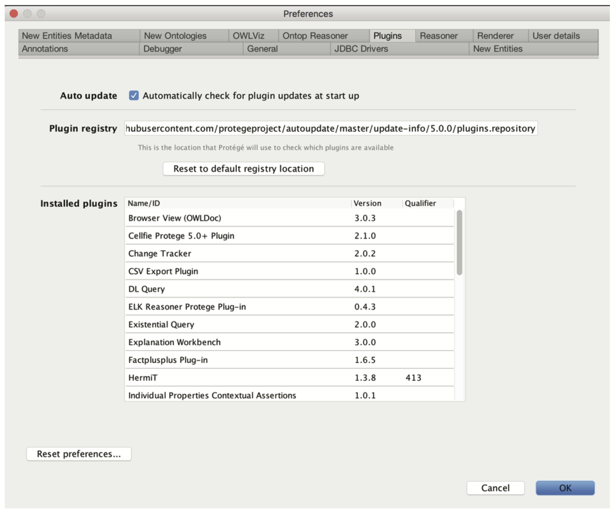
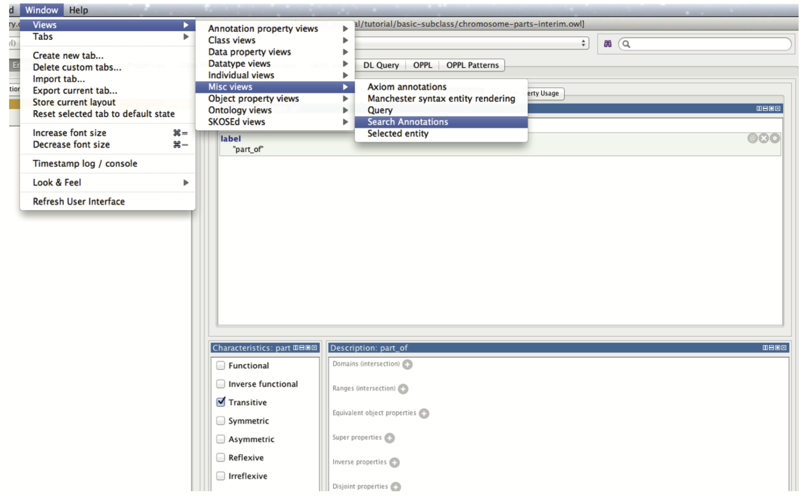

# Protégé plugins

Protégé is built on a plugin architecture. There is an active community of developers writing plugin extensions to Protégé. There is a plugin library in Protégé that allows you to pick and install plugins. You may also find plugins elsewhere on the web that must be installed manually. (_Note: Plugins are distributed as java archives (jars). To manually install a plugin you simply need to place the jar in the plugins folder inside the Protégé home/root directory.)_

You can find the plugin library in the Protégé preferences.  Go to your preferences and then the Plugins tab.

In older versions of Protégé, you may want to install the **Annotation Search Views** and the **Outline/Existential Tree** plugins. Instructions for older versions are below. Note: this is not necessary for Protégé 5.1. If you are using Protégé 5.1, skip to the next section on Disjointness.

## Annotation search plugin

Most plugins are either tabs, panels or menu items. The annotations search plugin provides a new panel that can be used to search through OWL annotations (such as labels and definitions).  Tabs and panels can be found in the Window menu. Under Window -> Views -> Misc views -> Search Annotations. Once selected your pointer will become a circular icon.  You can choose to drop this panel over any existing panel in Protégé by clicking. We recommend that you drop this panel to the right of the class hierarchy view, on top of the existing annotation view panel.

You can use the annotation search panel to search through all annotations, or restrict it to individual annotations, such as the label. The annotation view also supports _regular expression_ queries.
