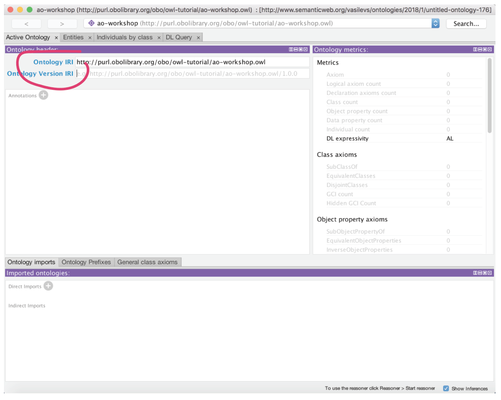
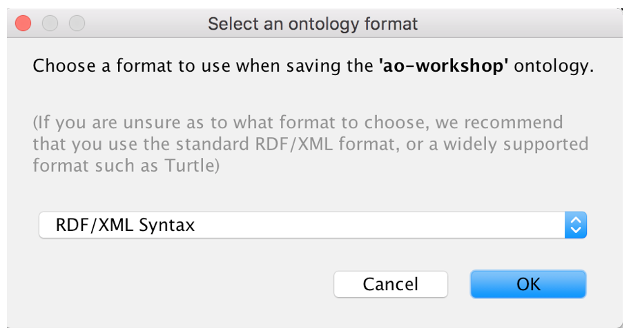
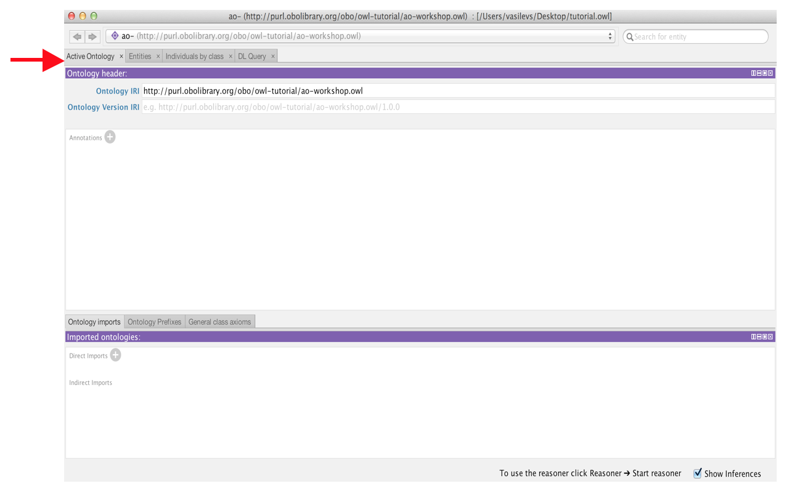
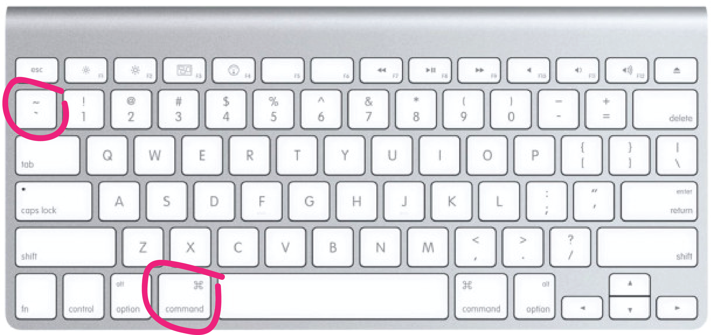
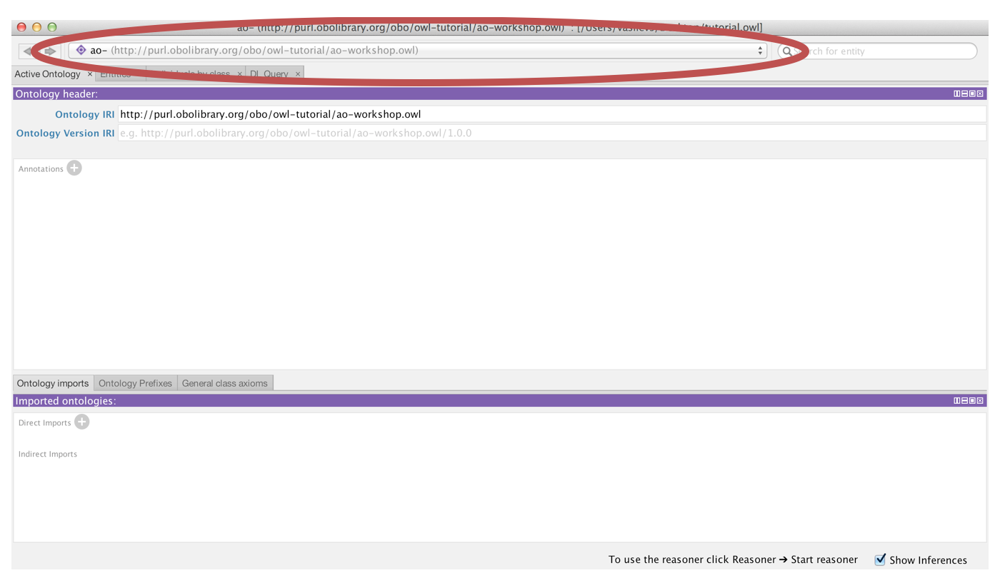
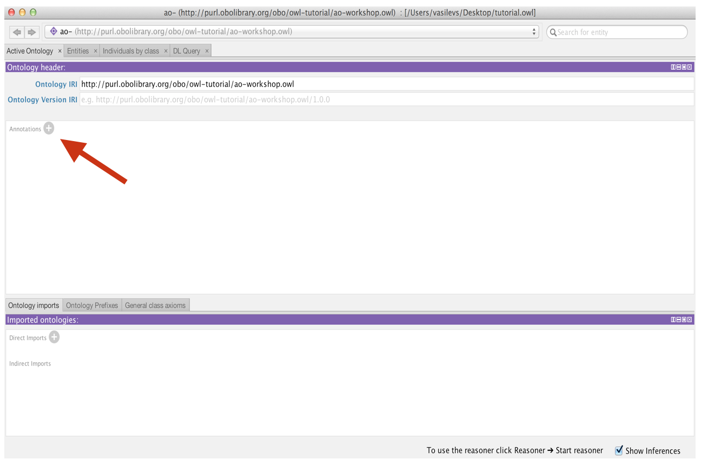
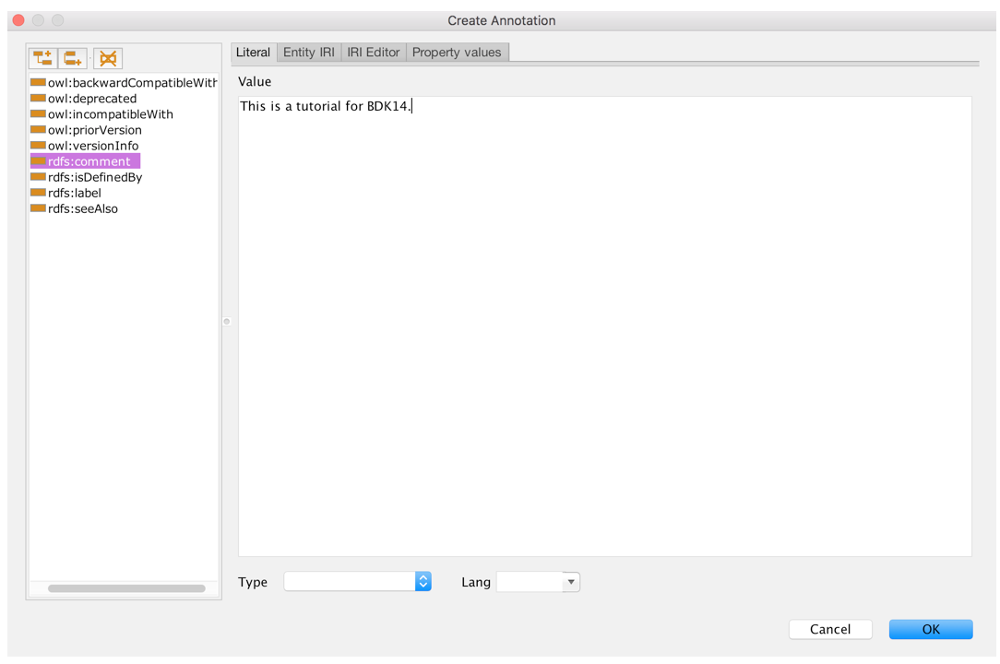
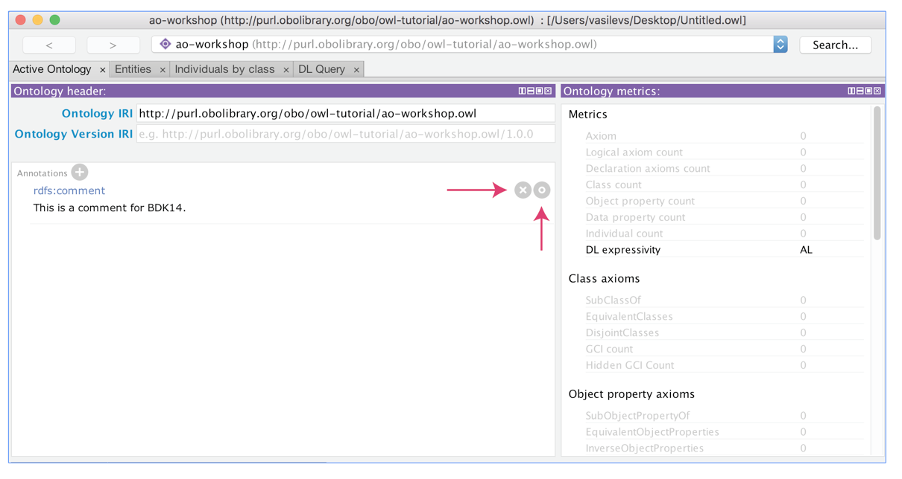

### Starting Protégé

When you start Protégé you are presented with a default empty ontology. 

To open Protege on the command line, navigate to your directory where your application is stored. 
See example below:
```
cd /Applications
cd Protege-5.1.0/
```
Type the command `open Protege.app` to open the Protégé application.


We will begin by clicking into the Ontology IRI field and providing an IRI. The IRI will be used to identify our ontology on the Web. You can set the IRI to anything you want at this stage, for this tutorial we will use "http://purl.obolibrary.org/obo/owl-tutorial/ao-workshop.owl"



You will also want to save this ontology file to your computer. Under the File menu select Save.  Use the next dialog box to specify the format of your ontology file.



Protégé allows you to save your ontology in a variety of OWL formats, including the OBO 1.2 flat file format. We recommend that you save your ontology in RDF/XML, as this is the most stable format to work with in Protégé. You can always choose to export your file in one of the other formats later.  Click OK to continue. Name your ontology, perhaps tutorial.owl. Choose a location on your computer to save your ontology.

#### The Protégé UI

The Protégé interface follows a basic paradigm of Tabs and Panels. By default, Protégé launches with the main tabs seen below. The layout of tabs and panels is configurable by the user.  The Tab list will have slight differences from version to version, and depending on your configuration.  It will also reflect your customizations.

To customize your view, go to the Window tab on the toolbar and select Views. Here you can customize which panels you see in each tab. In the tabs view, you can select which tabs you will see. You will commonly want to see the Entities tab and/or Classes tab and the Object Properties tab.



The first tab you see is the Active Ontology tab. Here you will find some basic meta-data about the ontology you are viewing. At the very top you see the IRI and file name of the active ontology you are viewing. Protégé allows you to work with multiple ontologies at once, so _this top bar is very important as it lets you know which ontology you are viewing and editing_.

Note: if you open a new ontology while viewing your current ontology, Protégé will ask you if you'd like to open it in a new window. If you select no, it will open in the current window and you can then switch back and forth to it from the Active Ontology tab.

If you say yes, it will open in a new window. If you use a Mac, you can toggle back and forth between each window by using the hot keys Command ~.





The panel in the center is the ontology annotations panel. You can use this panel to add basic meta-data to your ontology, such as the creation date, the authors and a short description. Using the annotation panel, create a simple comment on the ontology describing what it is about. First select the + button that is labelled Annotations.



A dialog will open, select the comment annotation on the left, and type your text into the text box on the right-hand side.  Click OK; to add the annotation.



The comment should appear in the ontology annotations where you have the option to either edit or delete it. Throughout the application, the grey-circle icons have related functionality: a **+** is used to add, **x** to delete, and **o** to edit.



The active ontology tab contains additional information about the ontology that we will explore later. These include a panel for managing ontology imports.
